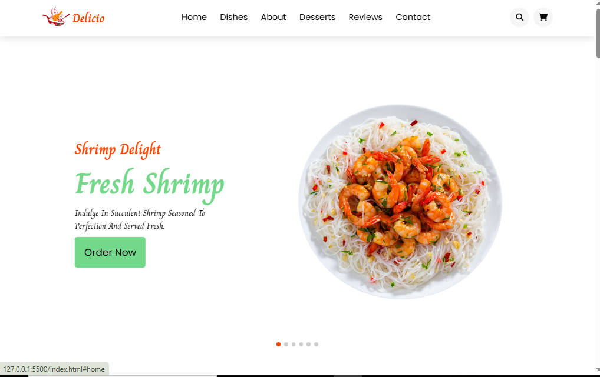

# 🍴 Delicio

### Delicious Flavors • Fresh Ingredients • Memorable Moments

A modern and responsive food website built with **HTML, CSS, and JavaScript**.

---

## ✨ About The Project

**Delicio** is a modern food website designed to provide a delicious and enjoyable digital experience for food lovers.

The project focuses on a clean and attractive interface, smooth navigation, interactive sections, and a responsive layout that works across different screen sizes.

---

## ✨ Features

* 🍴 Modern food website interface
* 📱 Fully responsive design
* 🏠 Interactive hero section with Swiper slider
* 🍔 Popular dishes section
* 🍰 Dedicated desserts section
* 🛒 Functional shopping cart
* ➕ Add multiple products to the cart
* 🗑️ Remove products from the cart
* 💰 Automatic cart total calculation
* 🔍 Search form interface
* 📖 About section
* ⭐ Customer reviews section
* 📩 Contact section
* 🧭 Smooth navigation between sections
* 📱 Responsive mobile navigation
* ✨ Scroll animations using AOS
* 🎨 Clean and modern user interface

---

## 🛒 Shopping Cart

The website includes a functional shopping cart where users can:

* Add multiple products to the cart
* Remove products from the cart
* View selected products
* Automatically calculate the total price
* Open and close the cart easily

---

## 🍰 Food & Desserts

Delicio includes dedicated sections for different food experiences:

* 🍔 Popular Dishes
* 🍰 Delicious Desserts
* 🍤 Featured food items
* ⭐ Customer reviews

Each product can be added directly to the shopping cart.

---

## 📱 Responsive Design

Delicio is designed to provide a smooth experience across:

* 💻 Desktop
* 💻 Laptop
* 📱 Tablet
* 📱 Mobile

---

## 🛠️ Technologies Used

---

## 🎯 Project Purpose

This project was created as a **frontend practice project** to improve web development skills and gain more experience with:

* HTML structure
* CSS styling
* Responsive web design
* JavaScript DOM manipulation
* Event handling
* Shopping cart functionality
* Swiper sliders
* AOS animations
* Building a complete frontend project

---

## 👩‍💻 Author

**Asmaa Qandil**

Frontend Developer • JavaScript Learner

---

## 🤍 Acknowledgment

Built with passion for food, clean design, and frontend development.
